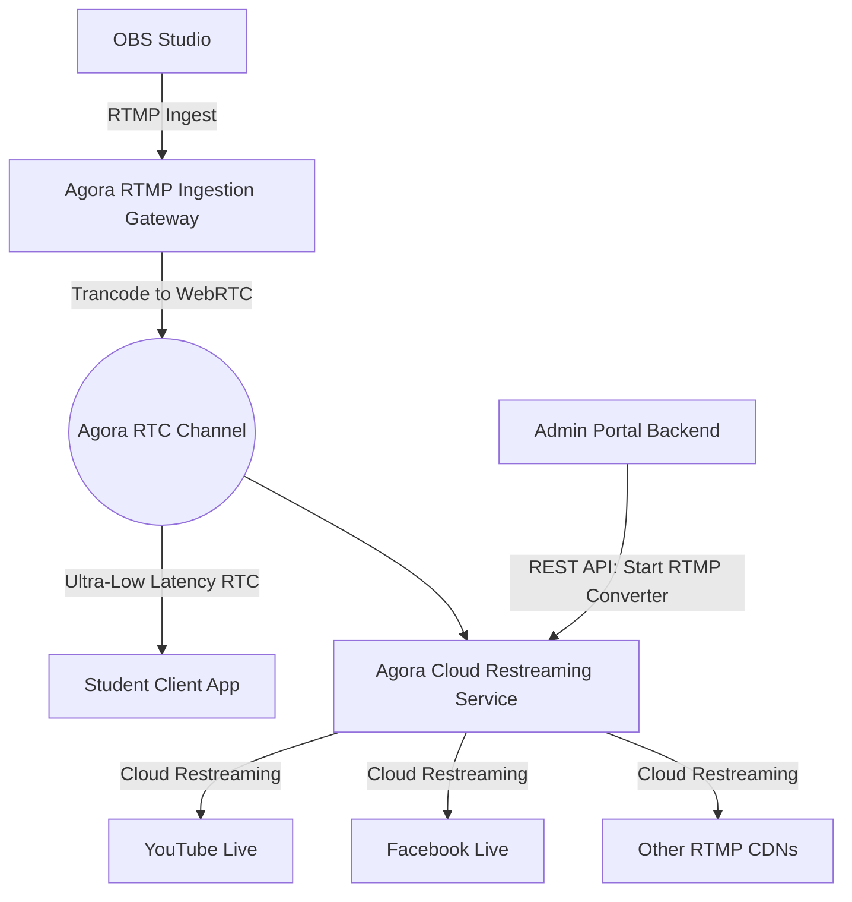
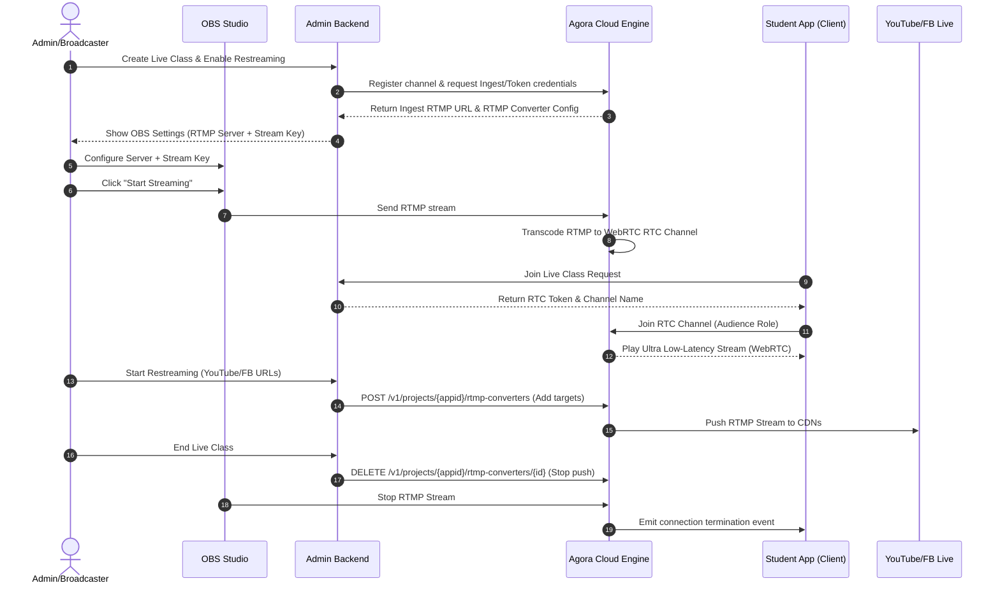

# Agora + OBS Multi-Platform Live Streaming Architecture

This document details the mechanism and step-by-step data/media flows to enable live class streaming from the Admin Portal using OBS Studio, distributing it via WebRTC (to students in-app) and RTMP (restreaming to YouTube, Facebook, etc.) simultaneously via Agora.

## High-Level Architecture

Instead of having the broadcaster stream to YouTube, Facebook, and the app separately (which would consume excessive local bandwidth and CPU), we use **Agora's Cloud Media Push** service.



---

## 1. Step-by-Step Flow

### Phase A: Setup and Key Generation
1. **Live Class Session Creation**:
   - Admin creates a Live Class record in the Admin Portal.
   - Backend generates an Agora RTC channel name (e.g. `live_class_<class_id>`).
   - Backend generates the **Agora RTC Token** for the broadcaster and audience.
2. **RTMP Ingestion Setup**:
   - The backend prepares the Agora RTMP Ingest URL where OBS will stream.
   - The RTMP Ingest URL structure: `rtmp://<ingest-domain>/live/<stream-key>`
   - The stream key is mapped dynamically to the Agora Channel.

### Phase B: OBS -> Agora Broadcast
1. The instructor inputs the RTMP server URL and Stream Key into OBS.
2. The instructor hits **"Start Streaming"** in OBS.
3. Agora Ingestion Gateway receives the RTMP stream, transcodes it, and pushes it into the Agora RTC Channel.
4. Students joining the channel on the app instantly receive the stream via WebRTC with sub-second latency (~300ms).

### Phase C: Multi-Platform Restreaming (Go Live to YouTube/Facebook)
1. In the Admin Portal, the Admin inputs destination RTMP URLs (e.g., YouTube's stream URL + stream key).
2. The Admin clicks **"Go Live to Platforms"**.
3. Admin Portal Backend makes a REST API request to Agora to **Start Cloud Media Push** (RTMP Converter).
4. Agora Cloud pulls the audio/video from the RTC channel, transcodes it, and streams it to the designated platforms.

---

## 2. Sequence Diagram



---

## 3. Agora Cloud Restreaming API Specification

To handle multi-platform go-live, the Admin Backend interacts with Agora's REST APIs. Here are the configuration details:

### Enable RTMP Converters (Restreaming)
Agora projects require the **RTMP Converter** feature enabled in the Agora Console to push RTC streams to CDN.

### REST API Endpoints

#### 1. Start RTMP Streaming to CDN
* **Method**: `POST`
* **URL**: `https://api.agora.io/v1/projects/{appid}/rtmp-converters`
* **Headers**: 
  - `Content-Type: application/json`
  - `Authorization: Basic <Base64(Customer_ID:Customer_Certificate)>`
* **Request Body**:
```json
{
  "converterId": "unique_converter_id_for_this_class",
  "channelName": "live_class_channel_123",
  "publishUrl": "rtmp://a.rtmp.youtube.com/live2/youtube_stream_key",
  "transcodingEnabled": true,
  "transcodingConfig": {
    "width": 1280,
    "height": 720,
    "videoFramerate": 30,
    "videoBitrate": 2000,
    "audioSampleRate": 48000,
    "audioBitrate": 128,
    "audioChannels": 2,
    "videoCodecProfile": 77,
    "userLayout": [
      {
        "x": 0,
        "y": 0,
        "width": 1280,
        "height": 720,
        "zOrder": 1,
        "alpha": 1.0,
        "uid": 666666
      }
    ]
  }
}
```
> [!NOTE]
> - `uid`: Represents the broadcaster UID inside the Agora RTC Channel.
> - If broadcasting to multiple CDNs (e.g. YouTube & Facebook simultaneously), make a separate `POST` request for each target RTMP URL, using a unique `converterId`.

#### 2. Stop RTMP Streaming
* **Method**: `DELETE`
* **URL**: `https://api.agora.io/v1/projects/{appid}/rtmp-converters/{converterId}`
* **Headers**:
  - `Authorization: Basic <Base64(Customer_ID:Customer_Certificate)>`

---

## 4. Admin Portal Implementation Strategy

### Admin UI Settings
Provide a **Live Stream Dashboard** containing:
1. **OBS Credentials Box**: RTMP Server URL and Stream Key (ready to copy).
2. **Restream Targets Box**: Text fields for entering external streaming URLs and keys (e.g., Youtube, Facebook) with toggle switches.
3. **Controls**:
   - `[Go Live on Platforms]` button.
   - `[Stop Restreaming]` button.
   - `[End Class]` button.

### Client-Side App Player Integration
For students, use the standard **Agora Web / Mobile SDK** rather than an RTMP player (like HLS/FLV):
- **Why**: WebRTC provides ~300ms latency, enabling real-time interaction (Q&A, live polls). HLS has 5–15 seconds delay.
- **Client Configuration**:
  ```javascript
  const client = AgoraRTC.createClient({ mode: 'live', codec: 'vp8' });
  await client.join(APP_ID, CHANNEL_NAME, TOKEN, UID);
  client.setClientRole('audience');
  ```
